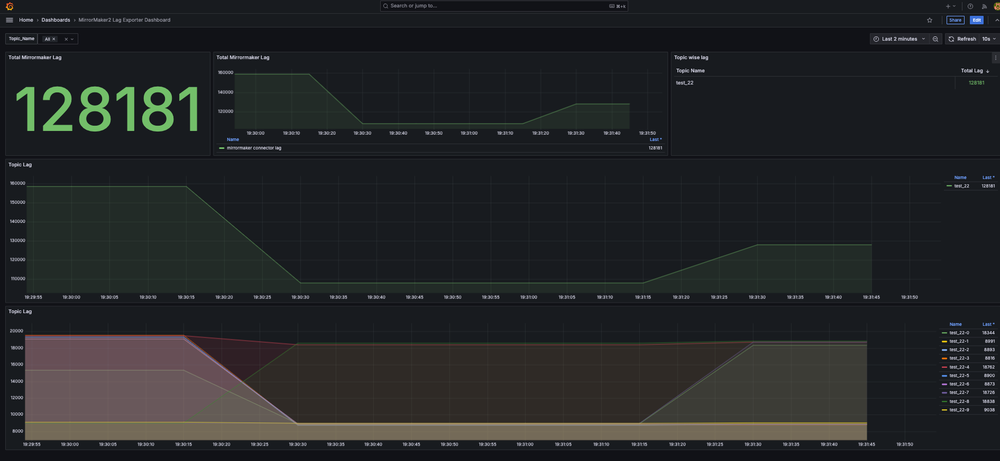

# Mirror Maker Exporter

[](https://github.com/mronconis/mirror_maker_exporter/actions/workflows/maven.yml)

Mirror Maker2 exporter for Prometheus.

## Build Binary

```shell
make
```

## Build Container Image

```shell
make image
```

## Push Container Image

```shell
make push
```

Quay.io Image
----------------

```shell
podman pull quay.io/mronconi/mirror-maker-exporter:1.0.0-SNAPSHOT
```

It can be used directly instead of having to build the image yourself. ([Quay Hub mronconi/mirror-maker2-exporter](https://quay.io/mronconi/mirror-maker-exporter)\)


## Topics

**Metrics details**

| Name                                               | Exposed informations                                |
|----------------------------------------------------|-----------------------------------------------------|
| `kafka_connect_mirror_lag`                         | Lag between source cluster and target cluster       |

**Metrics output example**

```txt
# HELP kafka_connect_mirror_lag Lag between source cluster and target cluster.
# TYPE kafka_connect_mirror_lag gauge
kafka_connect_mirror_lag{app="mm2-exporter",partition="2",topic="test",} 0.0
```

## Demo



```shell
make up
```

```shell
make down
```